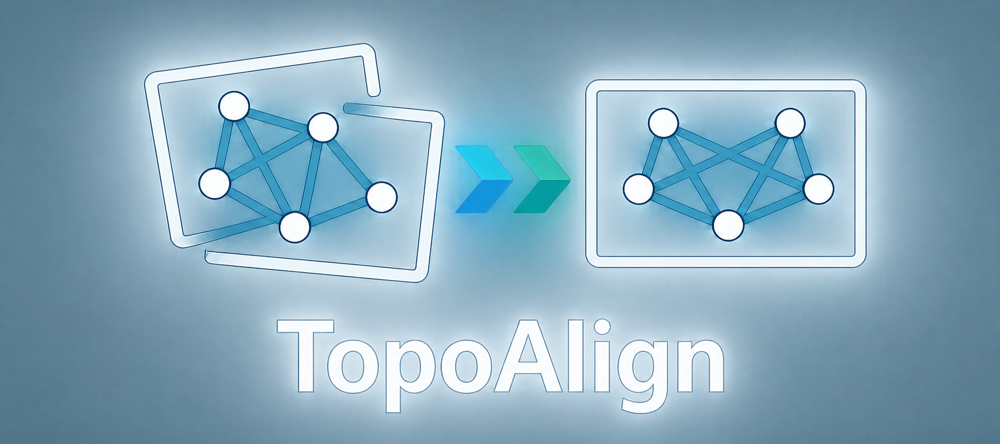

<div align="center">
  

  # TopoAlign

  **Topology-guided cellular image registration**

  [](https://www.python.org/)
  [](#cpu-installation)
  [](#gpu-installation)
  [](docs/index.rst)
</div>

TopoAlign is a topology-guided toolkit for cellular image registration. It
supports image, mask, and feature-table inputs with rigid, similarity, and
affine transformations.

## Installation

Clone the repository and enter its root directory:

```shell
git clone https://github.com/DNale-11/cell_registration.git
cd cell_registration
```

Choose one of the following complete environments.

### CPU installation

```shell
conda create -n cell_registration_cpu python=3.10 -y
conda activate cell_registration_cpu
python -m pip install --upgrade pip
python -m pip install torch==2.11.0 torchvision==0.26.0 --index-url https://download.pytorch.org/whl/cpu
python -m pip install -r requirements.txt
python -m pip install -e ".[agent]"
python -m pip install -e ./napari-cell-registration
```

### GPU installation

```shell
conda create -n cell_registration_gpu python=3.10 -y
conda activate cell_registration_gpu
python -m pip install --upgrade pip
python -m pip install torch==2.11.0 torchvision==0.26.0 --index-url https://download.pytorch.org/whl/cu128
python -m pip install -r requirements.txt
python -m pip install -e ".[agent]"
python -m pip install -e ./napari-cell-registration
```

## Documentation

Installation details, workflows, and all usage instructions are maintained in
the [TopoAlign User Manual](docs/index.rst).
