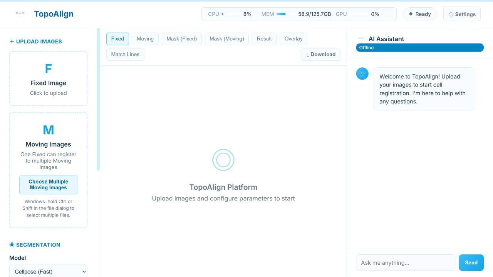

Web 用户指南
==============

启动服务
--------

必须从仓库根目录启动：

.. code-block:: powershell

   conda activate cell_registration_gpu
   python webapp/backend.py

浏览器打开 http://localhost:8000 。Windows 快捷脚本 ``.\webapp\start_server.bat``
只适用于名为 ``cell_registration_gpu`` 的 Conda 环境。

界面流程
--------

1. 上传图像
~~~~~~~~~~~~~~~~~~~~

* **Fixed Image** 选择一张参考图像。
* **Moving Images** 可一次选择一张或多张待配准图像。
* 当前文件选择器显示 TIFF 和 PNG；CLI 还支持 JPEG。
* 使用 **Active Moving / Result** 切换当前操作和查看的 Moving。

多图模式为 ``1 Fixed × N Moving``。浏览器按顺序提交每张 Moving，避免多个分割任务
同时争用 GPU；每张图像都有独立任务目录和结果。

2. 可选分割预览
~~~~~~~~~~~~~~~~~~~~~~~~

点击 **Run Segmentation** 可以先检查当前 Fixed/Moving 对的实例 mask，并在
**Mask (Fixed)** 与 **Mask (Moving)** 中查看。

.. important::

   该按钮是独立的质量检查任务，只针对当前活动的 Moving。它生成的 mask 当前不会被
   后续 **Run Registration** 自动复用；完整配准会重新执行分割。

3. 选择配准模式
~~~~~~~~~~~~~~~~~~~~~~~~

Normal registration
   用于常规二维细胞图像，执行 Cellpose-SAM 分割、拓扑两阶段匹配和几何变换。
   当前 Web 后端固定拟合 ``similarity`` 变换。

WSI registration
   先分割图像，再进行 WSI landmark 匹配和 KNN 局部仿射重采样。可调整
   ``wsi_top_k``、最大角度、KNN 邻居数/权重、面积过滤和残差过滤。

.. warning::

   Web WSI 流程会把上传图像加载到内存，并不等同于 napari 中基于 OpenSlide 的
   分块 WSI 读取。超大切片应先用代表性 ROI 验证，或改用 :doc:`napari_guide`。

4. 提交与查看结果
~~~~~~~~~~~~~~~~~~~~~~~~~~~~

点击 **Run Registration** 后观察进度和日志。批次完成后可以查看：

Original
   当前上传的 Fixed 或 Moving 原图预览。

Mask
   独立分割检查任务产生的 Fixed/Moving mask。

Result
   当前 Moving 重采样到 Fixed 坐标后的结果。

Overlay
   Fixed 与配准后 Moving 的伪彩叠加，用于观察结构一致性。

Match Lines
   并排显示两侧实例 mask 和真实匹配连线。为保证可读性，最多绘制 400 条代表性连线，
   标题仍显示匹配总数。

页面预览会按比例缩小，适合快速质检，不应从预览图测量定量像素值。

下载与本地文件
--------------

**Download** 当前只下载活动任务的 ``registered_moving.tif``。完整中间结果保存在：

.. code-block:: text

   data/
   ├── uploads/
   └── tasks/
       └── <task_id>/

需要 ``matches.csv``、``result.json``、mask 或完整诊断时，请直接读取对应任务目录。
Normal 与 WSI 输出的详细差异见 :doc:`outputs`。

当前实现注意事项
----------------

* 界面中的 **Cellpose / CellViT** 选择会随请求发送，但当前 Web 后端实际都调用
  Cellpose-SAM；不要把 CellViT 选项视为已生效。
* Normal 模式固定使用 ``similarity``。由于当前 RANSAC 实现只作用于刚性模型，
  Web 的 **RANSAC** 开关在 Normal 模式中目前不会改变拟合。
* 浏览器刷新会丢失当前上传列表、任务选择和批次进度。
* 服务重启后内存中的任务索引会丢失；``data/tasks`` 下的文件仍保留。
* API 服务监听 ``0.0.0.0:8000``、没有登录认证且允许跨域访问。只应在可信本机或
  受控内网使用，不要直接暴露到公网。
* Web Assistant 的 API URL、模型和 API Key 保存在浏览器 ``localStorage`` 中。
  不要在共享浏览器或不可信计算机中保存生产密钥。
